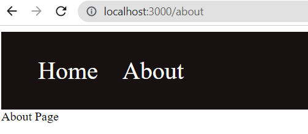
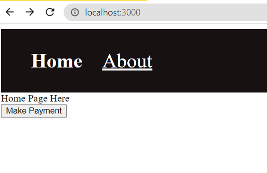
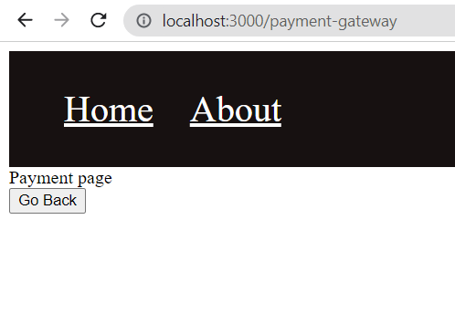

# React-Router

React Router Helps for client side routing

## Basic Routing

**components used**

- first import `BrowserRouter` component inside `index.js` file
- wrap `<App />` component around `BrowserRouter` component that we imported

```javascript
<BrowserRouter>
  <App />
</BrowserRouter>
```

To specify routing paths

- import Routes,Route components from `react-router-dom`

- Inside the Routes component specify your routes

```javascript
function App() {
  return (
    <div>
      <Routes>
        <Route path="/" element={<Home />}></Route>
        <Route path="about" element={<About />}></Route>
      </Routes>
    </div>
  );
}
```

- In the above code `path` prop tells us in which path we need to render a component specified inside the `element` prop

- For example in my case i gave 2 paths `/` is kind of `home` route and `about` route is to display about page

## React Router Links

In the above example for navigating to different routes we manualy typed the path name and navigated there. So you might have observed in so many websites we have links to move around in this section we are gone be seeing the same.

- import `Link` component inside your file. `Link` component is similar to `a`(anchor) tag in plain html

```javascript
import { Link } from "react-router-dom";

function Navbar() {
  return (
    <nav>
      <Link to="/">Home</Link>
      <Link to="/about">About</Link>
    </nav>
  );
}

export default Navbar;
```

Add the below style inside `index.js`

```css
nav {
  background-color: #171111;
  padding: 2rem;
}

nav a {
  font-size: 2rem;
  text-decoration: none;
  padding: 1rem;
  color: #fff;
}
```

- You will see below output



## React Router NavLinks

### Why NavLinks when we have Links

Well `NavLinks` component is used in specific use casess for example in nav links or in the breadcrums or in the certain tabs where we want to highlight certain things on click

```javascript
import { NavLink } from "react-router-dom";

function Navbar() {
  return (
    <nav>
      <NavLink to="/">Home</NavLink>
      <NavLink to="/about">About</NavLink>
    </nav>
  );
}
export default Navbar;
```

NavLinks component adds the class named `active` when we click on it
so that we can style it.

```css
nav a.active {
  font-weight: bold;
  text-decoration: none;
}
```

we can style the above `Navbar` component in a different way as well

```javascript
import { NavLink } from "react-router-dom";

function Navbar() {
  function NavBarStyles({ isActive }) {
    return {
      fontWeight: isActive ? "bold" : "normal",
      textDecoration: isActive ? "none" : "underline",
    };
  }
  return (
    <nav>
      <NavLink to="/" style={NavBarStyles}>
        Home
      </NavLink>
      <NavLink to="/about" style={NavBarStyles}>
        About
      </NavLink>
    </nav>
  );
}
export default Navbar;
```

- you will see the output like below


## Navigatting Programmatically

- Till now We learnt how to navigate using `Link` and `NavLink` components provided by `react-router-dom` library.

- `react-router-dom` gives us the `useNavigate` Hook using which you can navigate between routes

- Create a file called as `PaymentsPage.js` and add the below lines of code this code contain `Go Back` button when we click on it will take us back to home page

```javascript
import { useNavigate } from "react-router-dom";

function PaymentsPage() {
  const navigate = useNavigate();
  return (
    <>
      <h1>Payment page</h1>
      <button onClick={() => navigate(-1)}>Go Back</button>
    </>
  );
}
export default PaymentsPage;
```

- Add the below code to `Home.js` component

```javascript
import { useNavigate } from "react-router-dom";

function Home() {
  const navigate = useNavigate();
  return (
    <>
      <div>Home Page Here</div>
      <button onClick={() => navigate("/payment-gateway")}>Make Payment</button>
    </>
  );
}
export default Home;
```

- Below are the outputs of naviagting using `useNavigate` Hook





## Handling No Match Route Path

- Let's Say If you go to the path where in that path doesn't exists in that case we can show `page not found` message to user by creating component for that

- For that create `NoMatch.js` component and add the below code

```javascript
function NoMatch() {
  return (
    <>
      <div>Page Not Found</div>
    </>
  );
}
export default NoMatch;
```

- Inside `App.js` file add the below route

````javascript
<Route path="*" element={<NoMatch />}></Route>```
````

- Here '\*' has the special meaning this route will match only when no routes match
