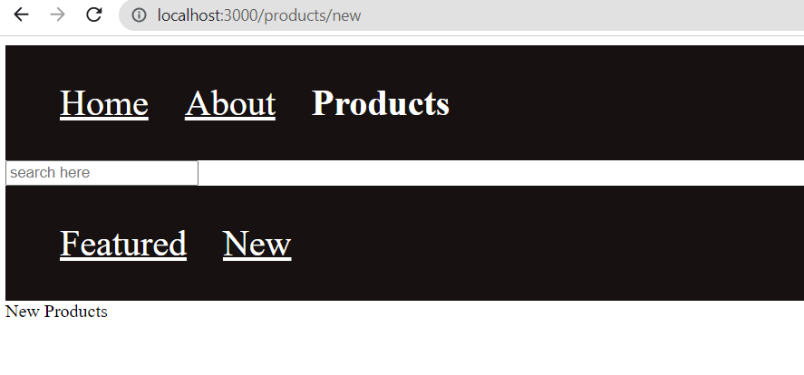
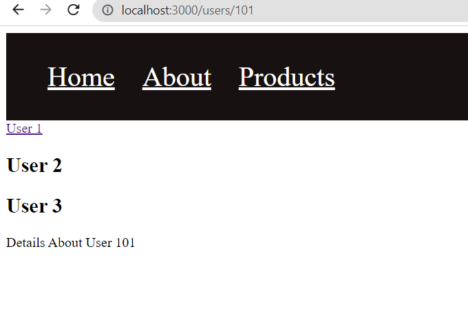
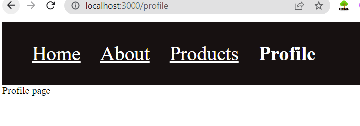

# React-Router

React Router Helps for client side routing

## Basic Routing

**components used**

- first import `BrowserRouter` component inside `index.js` file
- wrap `<App />` component around `BrowserRouter` component that we imported

```javascript
<BrowserRouter>
  <App />
</BrowserRouter>
```

To specify routing paths

- import Routes,Route components from `react-router-dom`

- Inside the Routes component specify your routes

```javascript
function App() {
  return (
    <div>
      <Routes>
        <Route path="/" element={<Home />}></Route>
        <Route path="about" element={<About />}></Route>
      </Routes>
    </div>
  );
}
```

- In the above code `path` prop tells us in which path we need to render a component specified inside the `element` prop

- For example in my case i gave 2 paths `/` is kind of `home` route and `about` route is to display about page

## React Router Links

In the above example for navigating to different routes we manualy typed the path name and navigated there. So you might have observed in so many websites we have links to move around in this section we are gone be seeing the same.

- import `Link` component inside your file. `Link` component is similar to `a`(anchor) tag in plain html

```javascript
import { Link } from "react-router-dom";

function Navbar() {
  return (
    <nav>
      <Link to="/">Home</Link>
      <Link to="/about">About</Link>
    </nav>
  );
}

export default Navbar;
```

Add the below style inside `index.js`

```css
nav {
  background-color: #171111;
  padding: 2rem;
}

nav a {
  font-size: 2rem;
  text-decoration: none;
  padding: 1rem;
  color: #fff;
}
```

- You will see below output


## React Router NavLinks

### Why NavLinks when we have Links

Well `NavLinks` component is used in specific use casess for example in nav links or in the breadcrums or in the certain tabs where we want to highlight certain things on click

```javascript
import { NavLink } from "react-router-dom";

function Navbar() {
  return (
    <nav>
      <NavLink to="/">Home</NavLink>
      <NavLink to="/about">About</NavLink>
    </nav>
  );
}
export default Navbar;
```

NavLinks component adds the class named `active` when we click on it
so that we can style it.

```css
nav a.active {
  font-weight: bold;
  text-decoration: none;
}
```

we can style the above `Navbar` component in a different way as well

```javascript
import { NavLink } from "react-router-dom";

function Navbar() {
  function NavBarStyles({ isActive }) {
    return {
      fontWeight: isActive ? "bold" : "normal",
      textDecoration: isActive ? "none" : "underline",
    };
  }
  return (
    <nav>
      <NavLink to="/" style={NavBarStyles}>
        Home
      </NavLink>
      <NavLink to="/about" style={NavBarStyles}>
        About
      </NavLink>
    </nav>
  );
}
export default Navbar;
```

- you will see the output like below


## Navigatting Programmatically

- Till now We learnt how to navigate using `Link` and `NavLink` components provided by `react-router-dom` library.

- `react-router-dom` gives us the `useNavigate` Hook using which you can navigate between routes

- Create a file called as `PaymentsPage.js` and add the below lines of code this code contain `Go Back` button when we click on it will take us back to home page

```javascript
import { useNavigate } from "react-router-dom";

function PaymentsPage() {
  const navigate = useNavigate();
  return (
    <>
      <h1>Payment page</h1>
      <button onClick={() => navigate(-1)}>Go Back</button>
    </>
  );
}
export default PaymentsPage;
```

- Add the below code to `Home.js` component

```javascript
import { useNavigate } from "react-router-dom";

function Home() {
  const navigate = useNavigate();
  return (
    <>
      <div>Home Page Here</div>
      <button onClick={() => navigate("/payment-gateway")}>Make Payment</button>
    </>
  );
}
export default Home;
```

- Below are the outputs of naviagting using `useNavigate` Hook


## Handling No Match Route Path

- Let's Say If you go to the path where in that path doesn't exists in that case we can show `page not found` message to user by creating component for that

- For that create `NoMatch.js` component and add the below code

```javascript
function NoMatch() {
  return (
    <>
      <div>Page Not Found</div>
    </>
  );
}
export default NoMatch;
```

- Inside `App.js` file add the below route

````javascript
<Route path="*" element={<NoMatch />}></Route>```
````

- Here '\*' has the special meaning this route will match only when no routes match

## Nested Routes

- Nested routers helps nest the Route paths inside the main Route

for example create `products.js` file inside the components folder and create `Route` for it inside the `App.js` file and also create the `NavLink` for products page. when anybody clicks on it user will be taken to products page inside it we need to create two more nav links namely `FeaturedProducts` and `NewProducts` first we need to create these two components and after that we will nest these two links inside the `products` route that we created

- products.js file

```javascript
import { Link } from "react-router-dom";

function Products() {
  return (
    <>
      <div>
        <input type="search" placeholder="search here" />
      </div>
      <nav>
        <Link to="featured">Featured</Link>
        <Link to="new">New</Link>
      </nav>
    </>
  );
}
export default Products;
```

- FeaturedProducts.js

```javascript
function FeaturedProducts() {
  return (
    <>
      <div>Featured products list</div>
    </>
  );
}
export default FeaturedProducts;
```

- NewProducts.js

```javascript
function NewProducts() {
  return (
    <>
      <div>New Products</div>
    </>
  );
}
export default NewProducts;
```

- Routes added inside `App.js` are below

```javascript
<Route path="products" element={<Products />}>
  <Route path="featured" element={<FeaturedProducts />} />
  <Route path="new" element={<NewProducts />} />
</Route>
```

-Also added `NavLink` for `products` page as below

```javascript
<NavLink to="/products" style={NavBarStyles}>
  Products
</NavLink>
```

- Output in local host



## Index Routes

- When we want to display the contents of the child Routes inside the parent Route index routes will come handy

- To create Index Routes we need to add `index` prop to Route change in `App.js` file like as shown below

```javascript
<Route index element={<FeaturedProducts />} />
```

## Dynamic Routes

- For example if we have Users list and we want to display user details on specific path then dynamic routes come into picture

- Dynamic routes are `:` prefixed so that we can mention whatever after the parent component

- Dynamic Routes look like below

```javascript
<Route path="users" element={<User />} />
<Route path="users/:userId" element={<UserDetails />} />
<Route path="users/admin" element={<Admin />} />
```

- Dynamic Routes can be nested as well like below

```javascript
<Route path="users" element={<User />}>
  <Route path=":userId" element={<UserDetails />} />
  <Route path="admin" element={<Admin />} />
</Route>
```

- If your using Nested routing always import `Outlet` component inside parent component

## URL Params

In the above concept of Dynamic routing we passed params dynamically to get the specific user details in that specific endpoint to access that parameter that is passed dynamically and display on to the screen we can use the Hook called `useParams` provided by the `react-router-dom`

changes made in the `UserDetails.js` file

```javascript
import { useParams } from "react-router-dom";

function UserDetails() {
  const params = useParams();
  const { userId } = params;
  return <div>Details About User {userId}</div>;
}
export default UserDetails;
```

ouput shows whenever we give different `userId` in the URL it displays that userId on the screen in the below image i gave 101 as the userId it is shown on the screen.



## Search Params

In the previous section you have seen how to add dynamic routes and how to get those dynamic routes and display on the page

In this section let us see how we can add params dynamically using `useSearchParams()` hook this hook is similar `useState` hook from ReactJS

In the below code I used `searchParams` and `setSearchParams` keywords to store returned value from `useSearchParams()` hook

```javascript
import { Link, Outlet, useSearchParams } from "react-router-dom";

function User() {
  const [searchParams, setSearchParams] = useSearchParams();
  const showActiveUsers = searchParams.get("filter") === "active";
  return (
    <>
      <Link to="user1">User 1</Link>
      <h2>User 2</h2>
      <h2>User 3</h2>
      <Outlet />
      <div>
        <button onClick={() => setSearchParams({ filter: "active" })}>
          Active Users
        </button>
        <button onClick={() => setSearchParams({})}>Reset Filter</button>
      </div>
      {showActiveUsers ? (
        <h2>Showing active users</h2>
      ) : (
        <h2>Showing all users</h2>
      )}
    </>
  );
}
export default User;
```

## Authentication and Protected Routes

- create `Profile.js` component

```javascript
function Profile() {
  return <div>Profile page</div>;
}
export default Profile;
```

- Add the below `NavLink` in the `Navbar.js`

```javascript
<NavLink to="/profile" style={NavBarStyles}>
  Profile
</NavLink>
```

- In the `App.js` congifure the new Route

```javascript
<Route path="profile" element={<Profile />} />
```

- When we click on `Profile` link here is the output



- But we want to make this `profile` route to be protected route this should be accessible only when user is logged in.

- create `auth.js` file inside components within this we will create `auth` context

```javascript

```

- In the `app.js` file we need to wrap entire component `<AuthProvider/>`

- In the compoents folder create `Login.js` file
